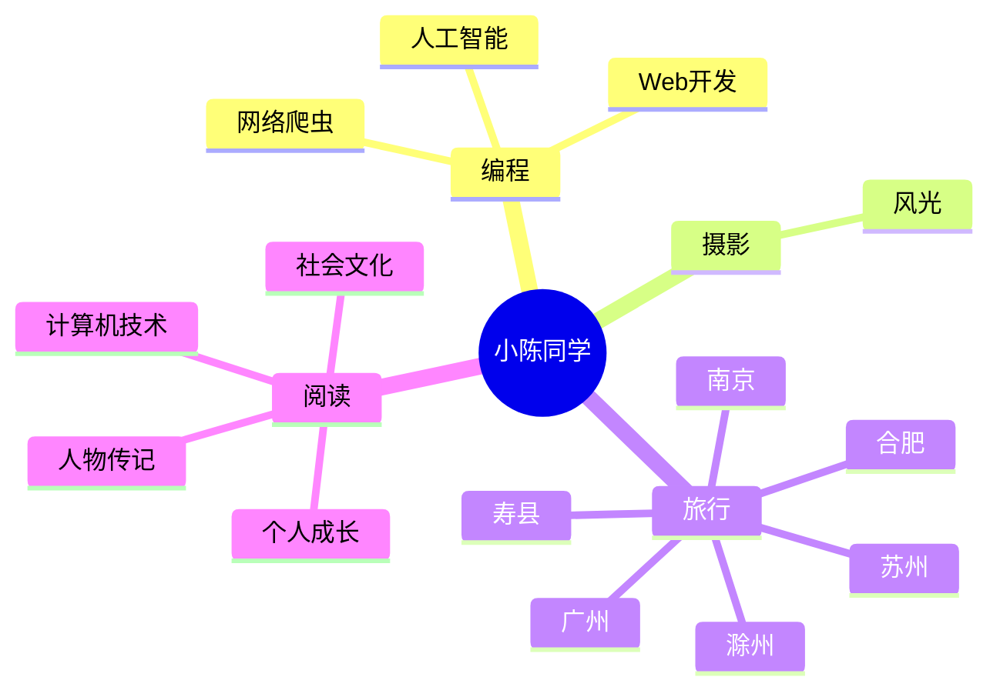
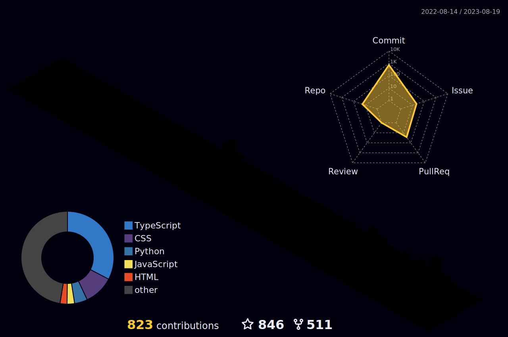

<div align="center">
  
  <!-- dynamic typing effect 动态打字效果 -->
  <div align="center">
    <a href="https://nbcnm.cn/">
      
    </a>
  </div>

  <!-- knock code pictures 敲代码的图片 -->
  <br>

  <!-- profile logo 个人资料徽标 -->
  <div align="center">
    <a href="https://twitter.com/AbrnYa/"></a>&emsp;
    <a href="https://space.bilibili.com/413741859/"></a>&emsp;
    <a href="https://nbcnm.cn/"></a>&emsp;
    <!-- visitor statistics logo 访问量统计徽标 -->
    
  </div>

<!-- Snake Code Contribution Map 贪吃蛇代码贡献图 -->
<picture>
  <source media="(prefers-color-scheme: dark)" srcset="./profile-snake-contrib/github-contribution-grid-snake-dark.svg" />
  <source media="(prefers-color-scheme: light)" srcset="./profile-snake-contrib/github-contribution-grid-snake.svg" />
  
</picture>

</div>

#  🙋 Hello

<table>
<tr><td>

<!-- About me 关于我 -->
### 🤺 About Me


<p>&emsp;&emsp;Hello everyone, I am Xiaochen, a student.</p>
<p>&emsp;&emsp;I have a passion for programming, photography, reading, and traveling.</p>
<p>&emsp;&emsp;I am enthusiastic about computer science and the IT industry, and I aspire to become an excellent developer.</p>
<p><strong>&emsp;&emsp;We're making the world a better place. Through constructing elegant hierarchies for maximum code reuse and extensibility.</strong></p>

</td></tr>

<tr>


<tr><td>

<!-- wakatime 统计 -->
### 📊 WakaTime

<picture>
  
</picture>
<picture>
  
</picture>

</td></tr>

<tr><td>

<!--START_SECTION:waka-->
**I'm an Early 🐤** 

```text
🌞 Morning                550 commits         ██████░░░░░░░░░░░░░░░░░░░   25.00 % 
🌆 Daytime                704 commits         ████████░░░░░░░░░░░░░░░░░   32.00 % 
🌃 Evening                642 commits         ███████░░░░░░░░░░░░░░░░░░   29.18 % 
🌙 Night                  304 commits         ███░░░░░░░░░░░░░░░░░░░░░░   13.82 % 
```
📅 **I'm Most Productive on Friday** 

```text
Monday                   261 commits         ███░░░░░░░░░░░░░░░░░░░░░░   11.86 % 
Tuesday                  195 commits         ██░░░░░░░░░░░░░░░░░░░░░░░   08.86 % 
Wednesday                312 commits         ████░░░░░░░░░░░░░░░░░░░░░   14.18 % 
Thursday                 259 commits         ███░░░░░░░░░░░░░░░░░░░░░░   11.77 % 
Friday                   662 commits         ████████░░░░░░░░░░░░░░░░░   30.09 % 
Saturday                 187 commits         ██░░░░░░░░░░░░░░░░░░░░░░░   08.50 % 
Sunday                   324 commits         ████░░░░░░░░░░░░░░░░░░░░░   14.73 % 
```


📊 **This Week I Spent My Time On** 

```text
🕑︎ Time Zone: Asia/Shanghai

💬 Programming Languages: 
Vue.js                   26 hrs 58 mins      ██████████████████████░░░   89.40 % 
JavaScript               1 hr 4 mins         █░░░░░░░░░░░░░░░░░░░░░░░░   03.54 % 
SCSS                     50 mins             █░░░░░░░░░░░░░░░░░░░░░░░░   02.78 % 
YAML                     20 mins             ░░░░░░░░░░░░░░░░░░░░░░░░░   01.12 % 
JSON                     17 mins             ░░░░░░░░░░░░░░░░░░░░░░░░░   00.96 % 

🔥 Editors: 
VS Code                  29 hrs 41 mins      █████████████████████████   98.41 % 
IntelliJ                 21 mins             ░░░░░░░░░░░░░░░░░░░░░░░░░   01.18 % 
Obsidian                 7 mins              ░░░░░░░░░░░░░░░░░░░░░░░░░   00.41 % 

💻 Operating System: 
Windows                  25 hrs 32 mins      █████████████████████░░░░   84.65 % 
Mac                      4 hrs 37 mins       ████░░░░░░░░░░░░░░░░░░░░░   15.35 % 
```


 Last Updated on 19/08/2023 01:07:14 UTC
<!--END_SECTION:waka-->
  
</td></tr>
</table>

<!-- ########################################## 分割 ########################################## -->


<div align="center" >



<!-- just img 图片 -->


<!--  skill badge 技能徽章 -->
💪 正在学习


  
🧠 计划学习


🧰 常用的工具


<!-- programming tool icon 编程工具图标 -->
<br>

<!-- svg -->


 


<br>

<!-- gif -->


<!-- just img 图片 -->
</div>

<!-- profile-3d-contrib 3D贡献图-->

</div>

<!-- ########################################## 分割 ########################################## -->


<div align="center" >

<!-- Github-Stats-Terminal 终端风格信息 -->
<br>
  
<!-- Quotes 名人名言 -->
<br>
  
<!-- GitHub 奖杯🏆 -->
<br>

<!-- GitHub 数据统计 -->

<br><br>


  
<!-- Wakatime Graph-->
<table>
  <tr>
    <td>
    <td></td>
  </tr>
</table>
</div>

<!-- ########################################## 分割 ########################################## -->


<div align="center">

<!-- run 图片 -->


<!-- Joke 笑话 -->
<div></div>

<!-- github-readme-streak-stats 连续提交代码天数记录 -->
&emsp;

&emsp;

<!-- metrics 基础资料 -->
&emsp;

&emsp;

<!-- GitHub Activity Graph GitHub 活动图 -->
<table align="center">
  <tr>
    <td></td>
  </tr>
</table>

</div>

<!-- ########################################## 分割 ########################################## -->


<!-- GitHub metrics 信息指标 -->
<div align="center">

<!-- just img 图片 -->


<!-- first form 第一个表格 -->
<table>
  <tr>
    <td></td>
  </tr>
</table>

<!-- second form 第二个表格 -->
<table>
  <tr>
    <td></td>
    <td></td>
  </tr>
  <tr>
    <td></td>
    <td></td>
  </tr>
  <tr>
    <td></td>
    <td></td>
  </tr>
  <tr>
    <td></td>
    <td></td>
  </tr>
  <tr>
    <td></td>
    <td></td>
  </tr>
  <tr>
    <td></td>
    <td></td>
  </tr>
</table>


<!-- just img 图片 -->

</div>
